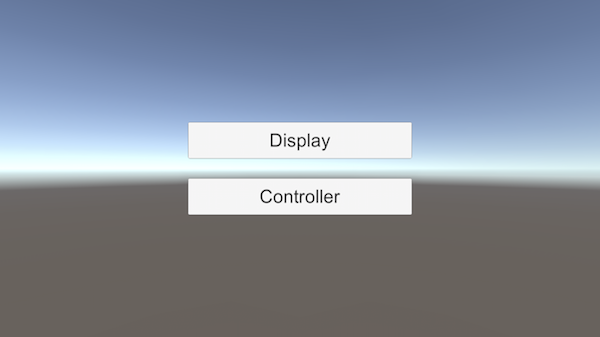
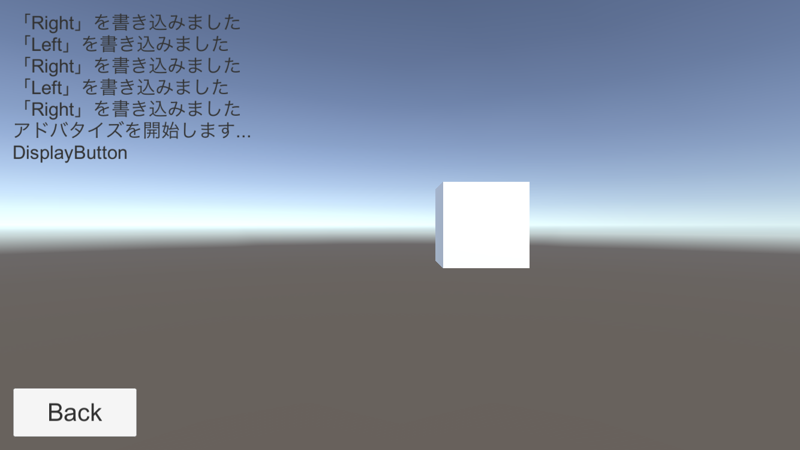
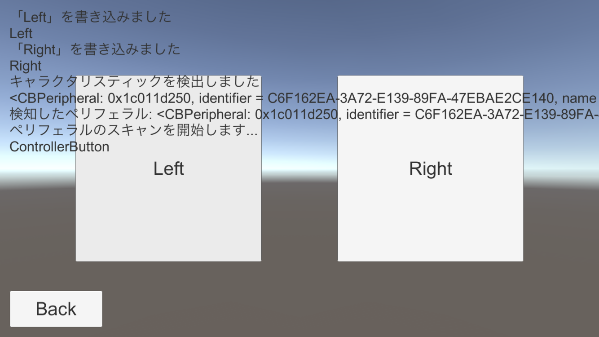
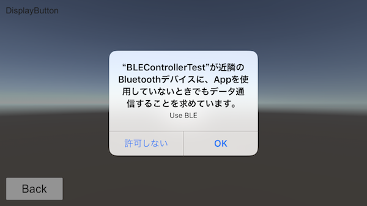

# BLEControllerTest - Unity Bluetooth Sample for iOS

Bluetooth 接続用のプラグインを Swift で書いて、Objective-C 経由で Unity と連携できるようにしたサンプルです

2台のiOS端末間で無線通信をして、片方の端末の操作によってもう片方のキューブが左右に動きます

- Bluetooth 接続周りは Core Bluetooth を使用し、Swift4 で書いています
- Unity（C#）から直接 Swift のコードを呼び出すことができないため、間に Objective-C のコードを挟んで呼び出しています


## このサンプルアプリの使い方

1. iOS端末を2台用意します
1. このリポジトリを clone し、Unity で iOS 用にビルド、同じアプリを2台にインストールします
1. 片方の端末で「Display」ボタンをタップ、もう片方で「Controller」をタップ
1. コントローラ側の「Left」と「Right」ボタンのタップ操作によって、ディスプレイ側の中央に表示されているキューブが左右に移動します

### メイン画面

### ディスプレイ側

### コントローラ側



## 環境
- macOS High Sierra 10.13.6
- Xcode 9.4.1 (Swift4)
- Unity 2018.2.5f1
- iOS 11.1.1 / 11.4.1


## ビルド方法
1. `Unity -> Build Settings` で `iOS` を選んで `Build And Run`
1. 生成された Xcode のプロジェクトを開く（勝手に開くと思う）
1. 実機をつないでビルドしながら、以下のトラブルシューティングを参考に各種設定を行う
1. 2台の端末の両方にアプリをインストールし、動作確認


## トラブルシューティング

初期状態では以下のエラーのほとんど出るかと思いますので、ひとつひとつ設定が必要です

### Unsupported Swift Version
```bash
Unsupported Swift Version

The target “Unity-iPhone” contains source code developed with Swift 2.x. Xcode 9 does not support building or migrating Swift 2.x targets.

Use Xcode 8.x to migrate the code to Swift 3.
```
`Build Settings -> Swift Compiler - Language -> Swift Language Version` で `Swift 4.1` を選択

### only available on iOS 10.0 or newer
```bash
/path/to/project/BLEControllerTest/build/ios/Libraries/Plugins/iOS/BluetoothCentral.swift:67:18: 'CBManagerState' is only available on iOS 10.0 or newer
```
`General -> Deployment Info -> Deployment Target` で  `10.0` 以上の値を設定する

### unresolved identifier 'UnitySendMessage'
```bash
/path/to/project/BLEControllerTest/build/ios/Libraries/Plugins/iOS/BluetoothCentral.swift:136:9: Use of unresolved identifier 'UnitySendMessage'
```
`Build Settings -> Swift Compiler - General -> Objective-C Bridging Header` に `$(SRCROOT)/Libraries/Plugins/iOS/Unity-iPhone-Bridging-Header.h` を追加


## トラブルシューティング（実行時エラー）

### Reason: image not found
```bash
dyld: Library not loaded: @rpath/libswiftCore.dylib
  Referenced from: /var/containers/Bundle/Application/278725B6-B4AA-41D7-9D7A-1E67615A704E/ProductName.app/ProductName
  Reason: image not found
(lldb) 
```
`Build Settings -> Linking -> Runpath Search Paths` の全部の項目に `@executable_path/Frameworks` を設定

### This app has crashed because it attempted to access privacy-sensitive data without a usage description
```bash
[access] This app has crashed because it attempted to access privacy-sensitive data without a usage description.  The app's Info.plist must contain an NSBluetoothPeripheralUsageDescription key with a string value explaining to the user how the app uses this data.
```
`Info.plist` に次の項目を追加  
Key : Privacy - Bluetooth Peripheral Usage Description  
Value : For Bluetooth Connection（任意の文言を設定、使用目的を書く）

この文言は以下のダイアログに表示される（写真の例は Value に「Use BLE」と入れた場合）


### XPC connection invalid
```bash
2018-09-14 22:11:54.861066+0900 ProductName[503:42290] [CoreBluetooth] XPC connection invalid
```
`Capabilities -> Background Modes` をONに設定  
以下の2つのチェックを入れる
- Uses Bluetooth LE accessories（Central通信を許可）
- Acts as a Bluetooth LE accessories（Peripheral通信を許可）

#### それでも同じエラーが出る場合
端末の設定を確認する
- `設定 -> Bluetooth` で表示される画面の下の方に「新しいデバイスを許可する」という文言が表示されている場合 -> タップする

※その他、端末側で Bluetooth が使えない設定になっている場合にこのエラーが出ることがある


## 開発時に出そうなエラー

### Unknown type name 'CBPeripheralDelegate'
```bash
/Users/name/Library/Developer/Xcode/DerivedData/Unity-iPhone-bovbwytreisgjtcmggsotqjerfeb/Build/Intermediates.noindex/Unity-iPhone.build/ReleaseForRunning-iphoneos/Unity-iPhone.build/DerivedSources/ProductName-Swift.h:212:61: Unknown type name 'CBPeripheralDelegate'
```
`BridgeForCallingSwiftMethodFromCSharp.mm` の `#import <ProductName-Swift.h>` の前に `#import <CoreBluetooth/CoreBluetooth.h>` を記述する

### No visible @interface for ...
```bash
/path/to/project/BLEControllerTest/Builds/iOS/Libraries/Plugins/iOS/BridgeForCallingSwiftMethodFromCSharp.mm:19:35: No visible @interface for 'BluetoothCentral' declares the selector 'connect'
```
Swift のメソッドの定義が、上手く `ProductName-Swift.h` 内に自動生成されないために起こるエラー  
`ProductName-Swift.h` に書き出したい Swift のメソッドに `@objc` を付ける（`BluetoothCentral.swift` のコードを参照）

### 上手く ProductName-Swift.h に定義が書き出されないときは
Xcode のメニューの `Product -> Clean` を実行すると `ProductName-Swift.h` は削除され、`Product -> Build` を行うと再生成される  
`Clean` をしなくても `Run` するだけで書き換わるはずだが、上手く書き換わらない場合は一度 `Clean` して `Build` する